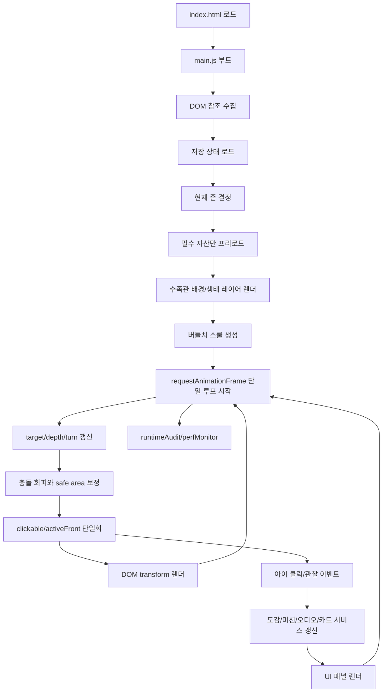

# v30A-1 구조 최적화 프롬프트

작성일: 2026-04-27  
기준 실행본: `app_assets/pongdang_gonjiam_v30A1_audio_stability_final/`

## 전수 검사 요약

- 현재 앱은 정적 HTML/CSS/JS 구조다.
- `index.html`: 약 195줄, 화면 DOM 대부분을 직접 포함한다.
- `src/app.js`: 약 663줄, 약 80KB. 데이터, 상태, 음성, GPS, 미션, 도감, 카메라, 유영 엔진, 렌더링, 디버그가 한 파일에 결합되어 있다.
- `src/styles/main.css`: 약 107줄, 약 40KB. 주요 UI와 수족관 스타일이 한 파일에 압축되어 있다.
- 이미지 자산은 PNG 39개, 총 약 60MB 이상이다. 메인 화면에서 모든 이미지를 한 번에 다루면 모바일 초기 부하가 커질 수 있다.
- 배경/물고기 자산 참조 누락은 현재 기준으로 발견되지 않았다.
- HTML 중복 `id`는 발견되지 않았다.
- `node --check` 기준 `src/app.js` 문법 검증을 통과했다.
- 도감 카드 이미지가 `ASSETS.sideRight`를 참조하던 오류는 `ASSETS.bodyRight`로 수정했다.

## 구조상 주요 리스크

- 메인 JS에 모든 기능이 집중되어 새 기능 추가 시 회귀 위험이 높다.
- 도감, 미션, 위치, 카메라, 음성, 유영 엔진이 같은 런타임 상태를 직접 만진다.
- 이미지 자산이 크므로 최초 로딩과 존 전환 시 모바일 메모리 부담이 생길 수 있다.
- CSS가 한 파일에 압축되어 있어 특정 메뉴 UI 변경이 다른 패널에 영향을 줄 수 있다.
- 현재는 `document.write` 캐시 버스터를 사용한다. 개발 중 즉시 반영에는 좋지만, 장기 구조에서는 자산 매니페스트 기반 로더가 더 안정적이다.

## 권장 목표 구조

```text
app_assets/pongdang_gonjiam_v30A1_audio_stability_final/
  index.html
  assets/
    bg/
      upper/
      rapid/
      soft-rapid/
      deep/
      pool/
    fish/
      beodeulchi/
        aquarium/
        card/
    ui/
      icons/
      buttons/
  src/
    main.js
    config/
      env.js
      cache.js
    data/
      zones.js
      species.js
      cards.js
      missions.js
      audioScripts.js
      uiMenus.js
    engine/
      aquariumState.js
      fishFactory.js
      fishMotion.js
      fishCollision.js
      fishPerspective.js
      fishRenderer.js
      frameLoop.js
    loaders/
      assetManifest.js
      imageLoader.js
      zoneAssetLoader.js
    ui/
      domRefs.js
      panels.js
      zoneStrip.js
      dexPanel.js
      missionPanel.js
      cameraPanel.js
      explorePanel.js
      popupLayer.js
      audioPanel.js
    services/
      audioGuide.js
      storage.js
      gpsService.js
      captureService.js
      missionService.js
      discoveryService.js
    debug/
      runtimeAudit.js
      perfMonitor.js
    styles/
      base.css
      aquarium.css
      fish.css
      panels.css
      navigation.css
      responsive.css
      main.css
```

## 권장 런타임 플로우



## 향후 업그레이드용 실행 프롬프트

```text
너는 “퐁당퐁당 곤지암천 v30A-1”을 향후 v31/v32로 안정적으로 확장하기 위한 구조 최적화 개발자다.

목표는 기능을 더 얹는 것이 아니라, 기존 동작을 보존하면서 화면 인터페이스, 메뉴, 이미지 자산, 수족관 엔진, 오디오, 저장소, 디버그 도구를 모듈별로 분리해 메인 페이지 부하를 줄이고 업그레이드 충돌을 막는 것이다.

기준 파일:
- app_assets/pongdang_gonjiam_v30A1_audio_stability_final/index.html
- app_assets/pongdang_gonjiam_v30A1_audio_stability_final/src/app.js
- app_assets/pongdang_gonjiam_v30A1_audio_stability_final/src/styles/main.css
- app_assets/pongdang_gonjiam_v30A1_audio_stability_final/assets/

반드시 지킬 원칙:
1. 기존 v30A-1 화면과 기능을 깨지 않는다.
2. 한 번에 전체를 갈아엎지 말고 단계별로 분리한다.
3. HTML은 앱 쉘과 핵심 레이어만 남기고, 반복 UI와 패널 내용은 JS 모듈 렌더러로 관리한다.
4. CSS는 base, aquarium, fish, panels, navigation, responsive로 분리한다.
5. 이미지 자산은 manifest로 관리하고, 현재 존과 현재 UI에 필요한 자산만 lazy/preload한다.
6. 버들치 유영 엔진은 data/UI/audio/storage와 독립시킨다.
7. requestAnimationFrame 루프는 하나만 유지한다.
8. activeFront와 clickable 물고기는 항상 1마리 이하로 유지한다.
9. 하단 메뉴, 패널, 팝업 safe area를 유영 엔진에서 참조할 수 있게 한다.
10. 캐시 무효화는 개발 모드에서만 강하게 적용하고, 운영 모드는 버전 매니페스트 방식으로 전환한다.
11. 모든 변경 후 node --check, 누락 자산 검사, 중복 id 검사, 로컬 서버 200 응답 검사를 수행한다.
12. `window.PondangV30A1Debug.audit()`와 같은 런타임 진단 도구는 유지하거나 더 강화한다.

1단계: 무변경 구조 분석
- 현재 app.js의 데이터 영역, 상태 영역, 서비스 영역, 유영 엔진 영역, UI 이벤트 영역을 주석 기준으로 구획화한다.
- index.html의 고정 DOM, 동적 패널, 반복 메뉴, 팝업, 디버그 영역을 분류한다.
- main.css의 수족관, 물고기, 네비게이션, 패널, 팝업, 반응형 규칙을 분류한다.
- 모든 assets 경로가 실제 파일로 존재하는지 검사한다.
- 중복 id와 undefined 참조를 검사한다.

2단계: 데이터 분리
- zones, species, dex cards, missions, audio scripts, feature menus를 src/data/*.js로 분리한다.
- 데이터 파일은 DOM을 직접 참조하지 않는다.
- 데이터 export/import 후 기존 화면 텍스트와 도감/미션 동작이 동일해야 한다.

3단계: 자산 로더 분리
- src/loaders/assetManifest.js에 배경, 버들치 몸통/꼬리/카드, UI 아이콘을 선언한다.
- src/loaders/imageLoader.js는 preload, lazyLoad, freshUrl, cacheVersion만 담당한다.
- 현재 존 배경과 현재 어종 프레임만 우선 로드하고, 도감 상세 이미지는 패널 열릴 때 로드한다.
- 60MB 이상의 PNG 전체를 초기 부팅에서 한꺼번에 decode하지 않는다.

4단계: 유영 엔진 분리
- fishFactory, fishMotion, fishCollision, fishPerspective, fishRenderer, frameLoop로 나눈다.
- 유영 엔진은 DOM 패널 내부 구현을 몰라야 하고, safeRect와 zone behavior만 입력받는다.
- 방향 전환은 감속 → 턴 프레임 → dir 전환 → 재가속 순서 유지.
- depth에 따른 scale/opacity/blur/zIndex 계산은 fishPerspective로 고정한다.
- 충돌 회피, clickable 단일화, 화면 복귀 로직을 테스트 가능한 순수 함수에 가깝게 분리한다.

5단계: UI 패널 분리
- bottom nav, feature panel, dex panel, mission panel, camera panel, explore panel, audio panel, popup layer를 src/ui/*.js로 나눈다.
- 각 패널은 open/close/render/bindEvents 네 가지 표준 함수를 가진다.
- 패널이 열릴 때 물고기 클릭 영역과 겹치지 않도록 UI_STATE와 safe area를 갱신한다.
- 메뉴 이미지는 assets/ui/icons/ 또는 uiMenus 데이터에서만 관리한다.

6단계: 서비스 분리
- audioGuide는 TTS와 중복 재생 방지만 담당한다.
- storage는 localStorage key와 migration을 담당한다.
- gpsService는 위치 권한과 추천 존 계산만 담당한다.
- captureService는 캔버스 캡처와 갤러리 데이터만 담당한다.
- missionService와 discoveryService는 진행률/도감 획득 상태만 담당한다.

7단계: 경량화
- 초기 로딩에서 필요한 것: index shell, base CSS, current zone bg, beodeulchi 5방향+꼬리 프레임, 최소 UI 아이콘.
- 나중 로딩으로 미룰 것: 도감 상세 이미지, 다른 어종 이미지, 카메라 갤러리 썸네일, 사용하지 않는 존의 night/day 배경.
- 이미지 파일은 가능하면 WebP/AVIF 후보를 만들되, 원본 PNG는 보존한다.
- 큰 배경은 모바일용/태블릿용/데스크톱용 크기별 후보를 manifest에 둔다.

8단계: 검증
- node --check로 모든 JS 문법 확인.
- HTML 중복 id 검사.
- assets 경로 존재 검사.
- 로컬 서버 index/app.js/main.css 응답 200 확인.
- 브라우저 콘솔에서 `PondangV30A1Debug.audit()` 실행 후 problems가 비어 있는지 확인.
- 모바일 세로 기준에서 하단 메뉴와 물고기 클릭 영역이 겹치지 않는지 확인.
- 도감, 미션, 카메라, 탐사, 음성 메뉴가 모두 열리고 닫히는지 확인.

최종 산출물:
- 기존 기능 동일 동작.
- 분리된 src 구조.
- 자산 manifest.
- 런타임 audit 유지.
- 구조 변경 기록 문서.
- 다음 버전 v31에서 어종 추가와 UI 이미지 교체가 app.js 대형 수정 없이 가능해야 한다.
```

## 우선 작업 순서

1. `ASSETS`/자산 manifest 정리.
2. `data/*.js` 분리.
3. `engine/*.js` 분리.
4. `ui/*.js` 분리.
5. `services/*.js` 분리.
6. CSS 분리.
7. 이미지 lazy loading과 responsive asset 적용.
8. 런타임 audit/perf monitor 강화.

## 완료 기준 체크리스트

- 메인 `app.js`가 20KB 이하의 부트스트랩 파일로 줄어든다.
- 각 메뉴는 독립 파일에서 관리된다.
- 이미지 경로는 코드 중간에 흩어지지 않고 manifest에서만 관리된다.
- 새 어종 추가 시 `species`, `cards`, `assetManifest`, `zoneSpeciesMap`만 수정하면 된다.
- 새 메뉴 추가 시 `uiMenus`와 해당 `ui/*.js`만 수정하면 된다.
- 물고기 유영 엔진 변경이 도감/카메라/오디오 코드에 직접 영향을 주지 않는다.
- `PondangV30A1Debug.audit().problems.length === 0` 상태를 목표로 한다.
